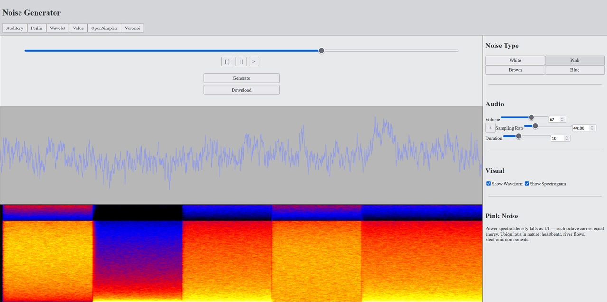
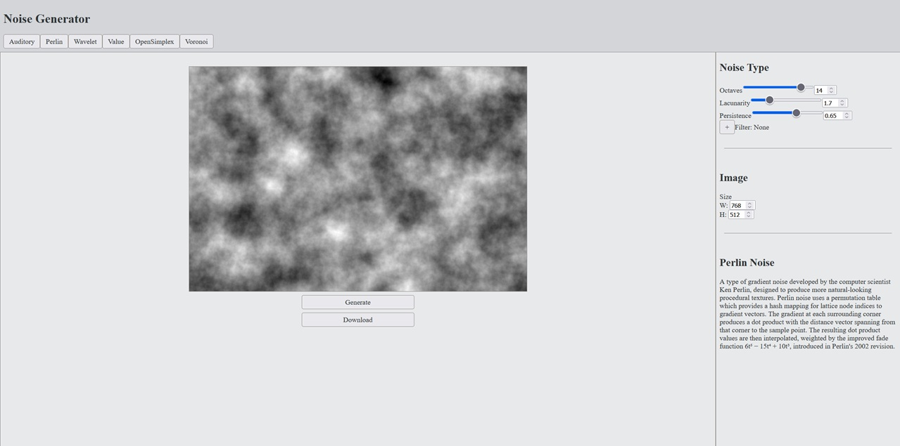
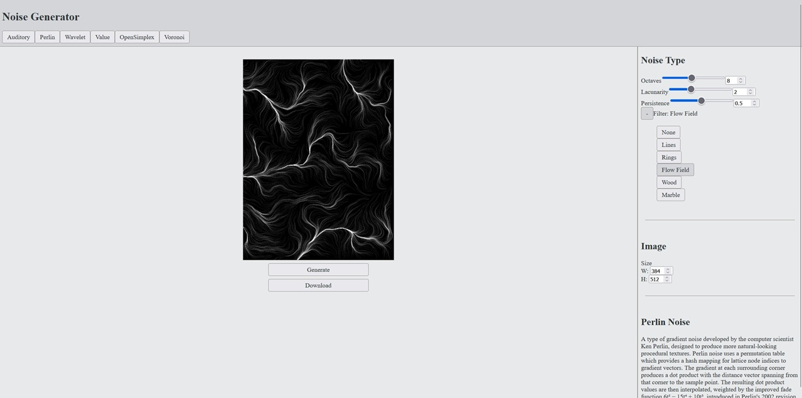
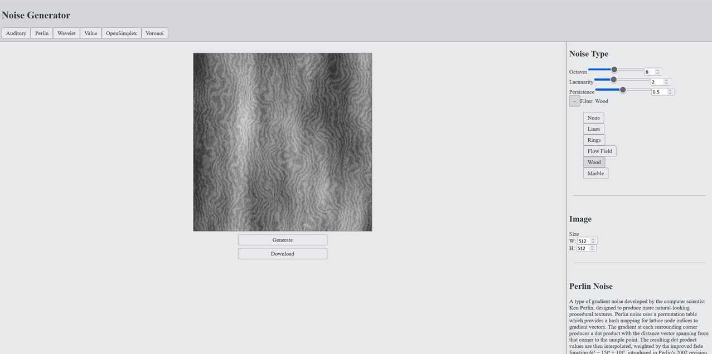

> ⚠️ README in progress
# Noise Generator (Python, Flask, JavaScript, React) | [Live Demo](https://aamithompson.github.io/NoiseGenerator/)
## 1. Overview
A web application built with **JavaScript**, **React**, **Python**, and **Flask** which allows users to create visual and auditory noise based on parameters chosen by the user. The current available noises are Brownian, white, pink and blue for auditory, and Perlin noise for visual.

The front-end is implemented with JavaScript and React then built with **Vite**. For the back-end, it is implemented with Python and utilizes Flask for the REST API implementation. Other libraries for the back-end include **NumPy**, **CuPy**, and **Pillow**.

The noise generation functions are built with modularity and choice between CPU and GPU processing in mind. For the auditory noise, it also processes the data with fast Fourier transformations to significantly speed up computation compared to the naive implementation.

## 2. Features

### Auditory Noise

- **Types** - Users can choose between one of the following noise types:
  - White Noise
  - Brown Noise
  - Pink Noise
  - Blue Noise

- **Parameters** - Users can also tune the parameters to control aspects of the audio with the following options:
  - Volume
  - Sampling Rate (Hertz)
  - Duration (seconds)

- **Playback Controls** - These controls allow for users to start, pause, or stop audio from playing once it is generated. There is also the slider itself which shows how far along the audio is in its playback and allows for users to drag it to set its current time.

- **Waveform Graph** - A display of the waveforms produced by the current audio. This graph is a measurement of amplitude in relation to time.
  
- **Spectrogram** - A display of the magnitude of frequencies at given times from current audio.

### Perlin Noise

- **Filters** - Various filters which apply mathematical modifications and/or layering of Perlin noise being generated. The following are options available to the users:
  - Lines
  - Rings
  - Flow Fields (particle tracing)
  - Wood
  - Marble

- **Parameters** - Users can also tune the parameters to control aspects of the Perlin noise with the following options:
  - Octaves: The number of generations of Perlin noise summed together.
  - Persistence: The multiplicative factor for the amplitude of the noise each generation.
  - Lacunarity: The multiplicative factor for the frequency of the noise each generation.
  - Width: Image width.
  - Height: Image height.


## 3. Screenshots

### Auditory Noise
*The auditory noise page. The left side displays the playback canvas with controls, waveform graph, and spectrogram. The right side contains the noise parameters. On the right are the controls for the noise.*



### Perlin Noise
*The Perlin noise page. This page has the image generation on the right. On the left are the controls both for the noise and the image.*



### Perlin Noise with Filters
*These are examples of the filters being applied to the noise. The first is a flow field, where particles trace paths along directions derived from the noise gradient. The second is a wood texture which has grain and lines.*




## 4. Installation & Usage (Local)

### Prerequisites
  - [Python 3.14](https://www.python.org/downloads/)
  - [Node.js](https://nodejs.org/en/download/)

### Setup
  1. Clone the repository.

### Running the Server & Client
  2.  With PowerShell opened in the server directory, run the virtual environment:
  ```bash
  venv\Scripts\activate
  ```

  3. Install the dependencies:
  ```bash
  pip install -r requirements.txt
  ```

  4. Then run the server application:
  ```bash
  python app.py
  ```

  5. With another instance of PowerShell opened in the client directory, retrieve the dependencies for the client:
  ```bash
  npm install
  ```

  6. With the instance of PowerShell opened in the client directory, run the development build of the client:
  ```bash
  npm run dev 
  ```

  7. Go to the link given in PowerShell to your browser. It should look something similar to:
  ```bash
  Local:   http://localhost:5173/NoiseGenerator/
  ```

## 5. Architecture
```text
NoiseGenerator/
├── client/
│   ├── src/
│       ├── components/
│       ├── context/
│       ├── data/
│       ├── pages/
│       └── styles/
├── server/
│   ├── NoiseGeneration/
│   ├── app.py
│   └── Enums.py
└── shared/
    └── constraints/
```

### Web Interface (Client)
The interface is written with JavaScript, HTML, CSS, and React with the builds done with Vite. There are three general components for all pages:
- **Header** - This serves as the navigation bar for the website and is an anchor point for users.
  
- **Canvas Area** - This holds the output and controls for immediate interaction with output such as generating and downloading. This can be graphs, playback sections, image displays, etc.
  
- **Controls Sidebar** - This contains options for users to select and input parameters which are given to the contexts to know what to pass to the server or how to handle real-time feedback.

These three components are not completely defined but serve as a template to customize for whatever each pages needs from them.

There are also **contexts** which handle data that can be passed between different files and functions in the code. Examples of this are:
- `AuditoryContext`:
  - `[selectedNoise, setSelectedNoise]`
  - `[volume, setVolume]`
  - `[samplingRate, setSamplingRate]`
  - `[duration, setDuration]`
  - `[showWaveform, setShowWaveform]`
  - `[showSpectrogram, setShowSpectrogram]`

- `PerlinImageContext`:
  - `[imageData, setImageData]`
  - `generateNoise(state)`
  - `downloadImage()`

Both of these communicate with the rest of the front-end of the application, allowing settings in the controls sidebar to communicate with canvases or pass data to be later sent to the server to process through an API request.

### Back-end Endpoints & Computation (Server)
The endpoints for the back end are handled through Flask. The implemented functions receive data, then ensure the data is within the bounds of acceptable input as defined by the constraint JSONs that is shared between the client and server. An example of this is `AuditoryNoiseConstraints.json`:
```json
{
    "settings": {
        "samplingRate": {
            "type": "int",
            "min": 8000,
            "max": 192000,
            "default": 44100
        },

        "duration": {
            "type": "float",
            "min": 1.0,
            "max": 30.0,
            "default": 5.0
        },

        "volume": {
            "type": "int",
            "min": 0,
            "max": 100,
            "default": 50
        },

        "noiseType": {
            "type": "int",
            "min": 0,
            "max": 3,
            "default": 0
        }
    }
}
```
This is then sent to one of the functions to produce expected outputs such as:
```python
GenerateNoiseWhite(duration, minF, maxF, sRate, att, comp)

GenerateVNoisePerlin(width, height, octaves, lacunarity, persistence, gridsize, comp)
```
Once the server is done running the computation, the results are sent back to the Flask functions to send back to the client that requested it.

### Deployment

- Front-End - deployed on GitHub Pages using GitHub Actions to deploy a new client program.
  
- Back-End - is deployed in Render.

While there is continuous deployment, there is currently no continuous integration through testing or linting.

## 6. Algorithms

### Brownian Noise (Brute Force/Spectral Implementation)
**Brownian noise** is a signal noise produced by **Brownian motion**, i.e., a mathematical model of the motion of particles in a fluid of some kind. The random fluctuation of particles creates a random walk of a particle in that environment or a cumulative sum of shifts in its position. The spectral implementation of this does so by constructing an infinite sum of sine waves of different weights. Since we cannot actually have an infinite sum, we truncate at some large finite N. The Brownian motion `W(t)` (Wiener process) on the interval `[0, π]` can be represented as:
```text
W(t) = (a₀/√π)·t  +  Σₙ (aₙ/n) · √(2/π) · sin(n·t)
```
Where every `aₙ` is an independent draw from the normal distribution `Normal(0,1)`. Each term in the sum is one *mode* or a sine wave of frequency `n`, scaled down by `1/n` and weighted by a random coefficient (our `aₙ`).

For Brownian noise, the *power* is proportional to amplitude² and thus at frequency `n` is proportional to `1/n²`, giving us the `1/f²` signature of brown noise.

We then tie everything together with the computation of the full path of the Brownian motion by using the drift term `(a₀/√π) · t` and adding our computed sums which are a sum of all `N` sine modes evaluated at time `t[i]`:
```text
(a₀/√π) · t + sums
```
The example python code can be seen here:
```python
#PARAMETERS
N = 10**6

#CONSTANTS
SQRT_PI = math.sqrt(math.pi)
SQRT_2DIVPI = math.sqrt(2/math.pi)

#COMPUTATION
n = np.arange(1, N+1)

#ALGORITHM
def GenerateBrownNoise(length):
    t = np.linspace(0, math.pi, length)
    an = np.random.normal(0, 1, N+1)

    sums = np.empty(length)
    for i in range(length):
        sequence = BrownSequence(an[1:], n, t[i])
        sums[i] = np.sum(sequence)

    return (an[0]/SQRT_PI) * t + sums

def BrownSequence(a, n, t):
    return (a/n) * SQRT_2DIVPI * math.sin(n * t)
```

This then evaluates to a time complexity `O(N ⋅ length)` which is enormous even with moderate sampling rates for a few seconds. For demonstration, at N = 10⁶ modes and a modest 44,100 samples (1 second of audio at CD quality), this requires roughly 44 billion floating point operations per second of output. This problem drove me to search for how signal noise *really* is handled on computers because this would be ridiculous to compute in a timely manner.

### Brownian Noise (Fast Fourier Transform)
To improve on the computation time, rather than work in the *time domain* with the spectral approach, we can work directly in the *frequency domain*. A **Fourier transform** converts a signal from its original domain which is usually time or space into a frequency domain. A **fast Fourier transform** is an algorithm which computes the discrete Fourier transform of a sequence. Now, if we know what the frequency spectrum *should* look like, and that is less information we need to work with, then it might be computationally better to work from this point and utilize an inverse FFT to convert it into the time domain instead. We compute our samples count as the duration we need multiplied by the sampling rate, i.e.:
```text
samples = duration * sampling rate
```
We then use this to compute the *frequency bins*, which is a collection of discrete buckets representing a continuous range of frequencies. Also since the signal is real-valued we only need positive frequencies thus we only need half of the frequencies. The following is code for this computation:
```python
f = np.fft.rfftfreq(samples, 1/sRate)
```

We then assign each frequency bin an amplitude according to a power law `f^(-β)`. The exponent `-β` is derived from an `fPower` (which is the noise color, in our case `fPower = 2` for brown noise) and the attenuation `att` (which is decibels (dB) per octave).
```python
spectrum[1:] = f[1:]**(-(0.5 * fPower * (att/10.0) / np.log10(2.0)))
```

We can then take out the frequencies that are outside of hearing range which is generally `[20Hz-20kHz]`. This is bandlimiting:
```python
spectrum[np.logical_or(f < minF, f > maxF)] = 0
```

However, this is still a deterministic signal and thus we need to introduce the *noise* of it. We can apply a random phase to each frequency bin uniformly drawn from `[0, 2π]` in order to scramble the time domain structure. This eliminates having a clean, repeating waveform:
```python
phases = np.random.uniform(0, 2 * np.pi, len(f) - 1)
spectrum[1:] *= np.exp(1j * phases)
```

Now that our frequency bins are set up, we can apply an inverse fast Fourier transform to convert it to time domain. We also pad it to handle off by one samples `irfft` can produce:
```python
noise = np.fft.irfft(spectrum)
noise = np.pad(noise, (0, samples - len(noise)))
```

Then finally we normalize it to rescale the output to `[0, 1]`. The complete code is as follows:
```python
# Default arguments for audio
DEFAULT_DURATION = 1.0
DEFAULT_FPOWER = 1
DEFAULT_MINF = 20
DEFAULT_MAXF = 20000
DEFAULT_SRATE = SRATE_CD
DEFAULT_ATT = np.log10(2.0)*10
DEFAULT_COMP = 'CPU'


def GenerateNoiseCPU(duration=DEFAULT_DURATION, fPower=DEFAULT_FPOWER, minF=DEFAULT_MINF, maxF=DEFAULT_MAXF, sRate=DEFAULT_SRATE, att=DEFAULT_ATT):
    samples = int(duration * sRate)
    f = np.fft.rfftfreq(samples, 1/sRate)

    spectrum = np.zeros_like(f, dtype='complex')
    spectrum[1:] = f[1:]**(-(0.5 * fPower * (att/10.0) / np.log10(2.0)))
    spectrum[np.logical_or(f < minF, f > maxF)] = 0

    phases = np.random.uniform(0, 2 * np.pi, len(f) - 1)
    spectrum[1:] *= np.exp(1j * phases)

    noise = np.fft.irfft(spectrum)
    noise = np.pad(noise, (0, samples - len(noise)))
    noise = (noise - np.min(noise)) / (np.max(noise) - np.min(noise))

    return noise
```

And we get specifically brown noise using a wrapper and constant:
```python
FPOWER_BROWN = 2.0
def GenerateNoiseBrown(duration=ns.DEFAULT_DURATION, minF=ns.DEFAULT_MINF, maxF=ns.DEFAULT_MAXF, sRate=ns.DEFAULT_SRATE, att=ns.DEFAULT_ATT, comp=ns.DEFAULT_COMP):
    return ns.GenerateNoise(duration, FPOWER_BROWN, minF, maxF, sRate, att, comp)
```

This version has a time complexity of `O(length · log(length))`, a considerable improvement over `O(N ⋅ length)`. At the same 44,100 samples, this requires roughly 700,000 operations — compared to 44 billion for the spectral approach.

### Noise Colors

### Auditory Noise

### Perlin Noise

## 7. Security

### Verifying Parameters Server Side

### Limiter

## 8. Future Work / Optimization Considerations 

### Voronoi/Worley Noise

### Simplex Noise

### Value Noise

### Benchmarking

### Error Handling

## 9. License
This project is licensed under the GPL-3.0 License - see the `LICENSE` file for details.
